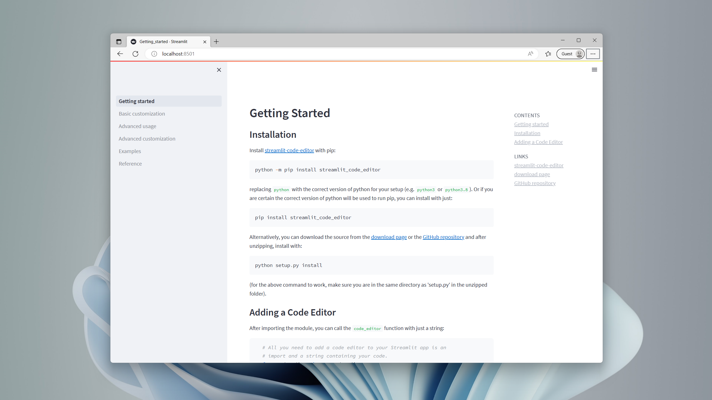

streamlit code editor  [](https://pypi.org/project/streamlit-code-editor/#history) [](https://pypi.org/project/streamlit-code-editor/#files)
============

A code editor component for streamlit.io apps, built on top of react-ace, with custom themes and customizable interface elements.

## Installation
Install [streamlit-code-editor](https://pypi.org/project/streamlit-code-editor/) with pip:
```bash
pip install streamlit_code_editor
```
Alternatively, you can download the source from the [download page](https://pypi.org/project/streamlit-code-editor/#files) and after unzipping, install with:
```bash
python setup.py install
```
(make sure you are in the same directory as 'setup.py' in the unzipped folder).

## Usage
To add a Code Editor to Streamlit python app, import `code_editor` and then call the `code_editor` function with the code you want to edit (as a string):
```python
import streamlit as st
from code_editor import code_editor

response_dict = code_editor(your_code_string)
```
Without specifying a language, the editor will default to `python`. You can also specify a language with the `lang` argument:
```python
# The default value for the lang argument is "python"
response_dict = code_editor(your_code_string, lang="javascript")
```
By default, each code editor is styled like streamlit's code component. We will go over how to customize the styling in a later section.
## Docs 
[](https://code-editor-documentation.streamlit.app/)


## Demo

[](https://bouzidanas-streamlit-i-streamlit-code-editorexamplesdemo-lq20k3.streamlit.app/)


